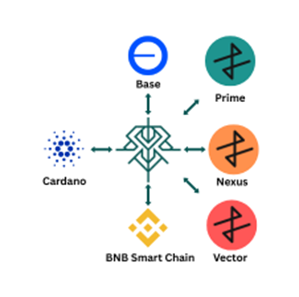
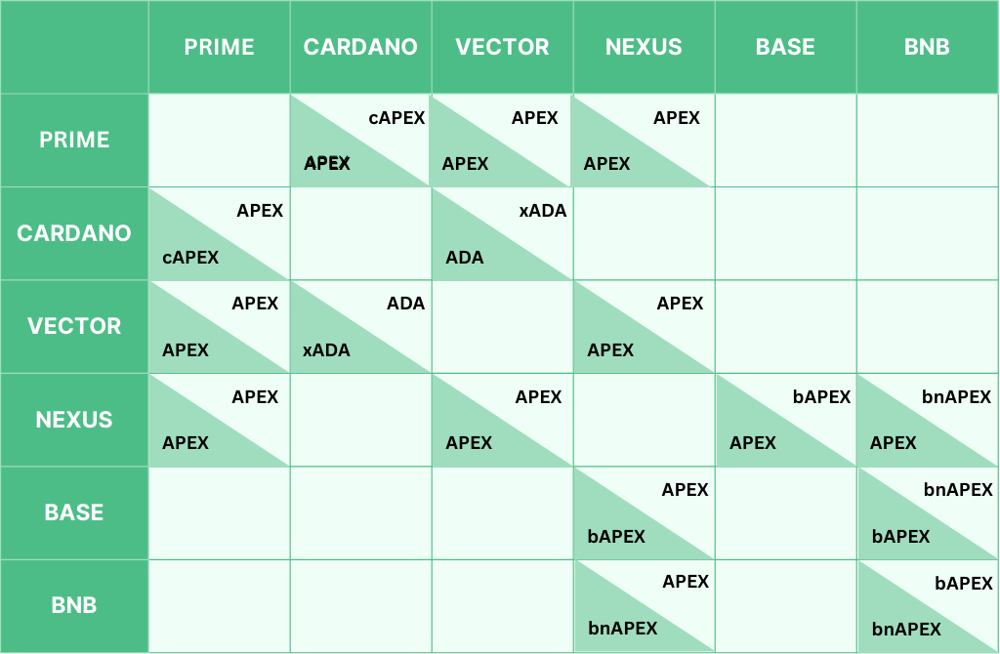

# Introduction

As blockchain technology rapidly matures, the vision of an interconnected decentralized economy has emerged as one of its most ambitious and promising frontiers. Blockchain ecosystems have quickly realized that in isolation, their growth and innovation potential is severely limited. Interoperability, the ability to transfer assets and data seamlessly across blockchain networks, is one of the central challenges of the decentralized world and is critical to fulfilling blockchain’s potential.

The Skyline bridge (Figure 1) emerges precisely to address this critical challenge of interoperability, particularly targeting the communication between prominent Unspent Transaction Output (UTXO) based blockchain platforms: Cardano, Apex Fusion’s Vector, and Apex Fusion’s Prime and EVM-type chains: Apex Fusion’s Nexus, Base, and BNB Smart Chain. 

<figure><figcaption>
Figure 1 - Global overview of Skyline
</figcaption></figure>

Cardano, Apex Fusion’s Prime, and Apex Fusion’s Vector represent advanced UTXO-based blockchain ecosystems, boasting strong security guarantees, advanced cryptographic protocols, and innovative smart contract platforms. 
Apex Fusion’s Nexus, Base, and BNB Smart Chain represent advanced EVM-compatible blockchain ecosystems, each offering robust support for Ethereum Virtual Machine smart contracts, broad developer tooling, and seamless access to the wider Ethereum ecosystem.
Yet, despite technological advancements of previously mentioned chains, they remain largely isolated from one another due to the absence of a direct interoperability solution.

Skyline solves this critical challenge by serving as a decentralized gateway between these blockchains, effectively enabling the seamless exchange of native assets(Figure 2). Depending on the asset and chain mechanics, Skyline locks or burns native tokens on the origin chain through a verifiable process, and then unlocks or mints the appropriate tokens on the destination chain. This mechanism ensures secure cross-chain transfers while preserving transparency and decentralization.

figure><figcaption>
Figure 2 - Bridgable token list
</figcaption></figure>

Skyline is designed to operate without reliance on any centralized authority, ensuring resilience and censorship resistance based on elliptic-curve signatures. Its decentralized validation system utilizes multisignature UTXOs, one of the strongest cryptographic primitives inherent to both Cardano and Apex Fusion platforms, and elliptic-curve signatures on EVM-compatible networks, together with smart-contract-level verification.To boost user experience, Skyline provides an automated refund mechanism for possible transaction failures, as well as a robust liquidity management system.
Skyline is designed with user convenience in mind, offering an intuitive and approachable user interface to improve the end-user experience.

This document details the comprehensive vision, system design, and operational principles of the Skyline, including a thorough exploration of its architectural components, its underlying mechanisms for security and decentralization, and the practical implications of enabling interoperability between Cardano, Apex Fusion’s Prime, Apex Fusion’s Vector, Nexus, Base and BNB Smart chain ecosystems.
